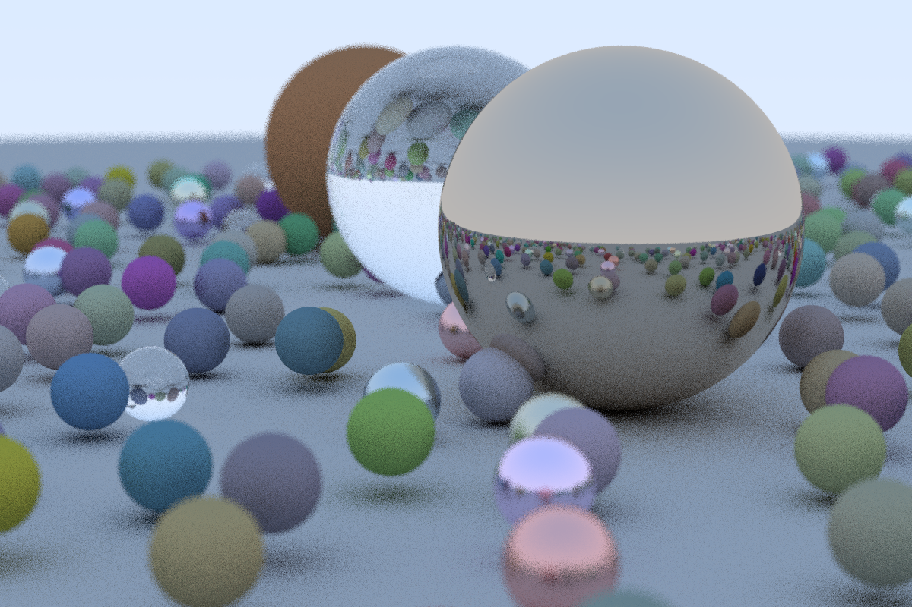

Ray Tracing Implementation using Julia
======================================

Didactic ray tracing implementation using Julia, ported from [Ray Tracing in One Weekend](https://github.com/RayTracing/raytracing.github.io) by Peter Shirley.

Quickstart
----------
Several examples can be found in the *examples* subfolder as Jupyter notebooks.

About
-----
Written by Christian B. Mendl beginning 2020.
